# StarWarsApp - Version 2

> All right resolved to Disney and SWAPI developer team\
> Hello There! Do you love Star Wars? In that case please check my page.  

# Topics: 
- [Appereance](#apperance)
- [Helpfull Websites](#helpfull-websites)
- [Contact](#contact)

# Apperance:
## Light Theme:
#### Home Page:
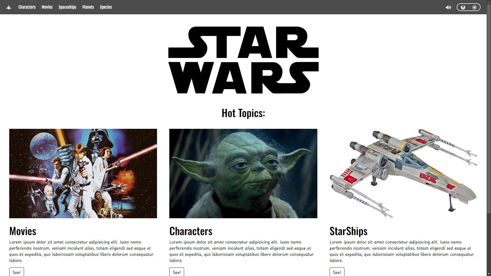
#### Character List:
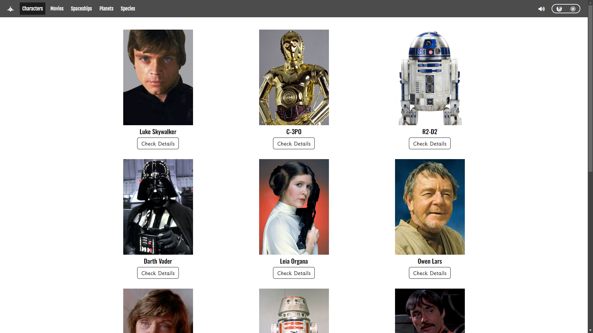
#### Planet List: 
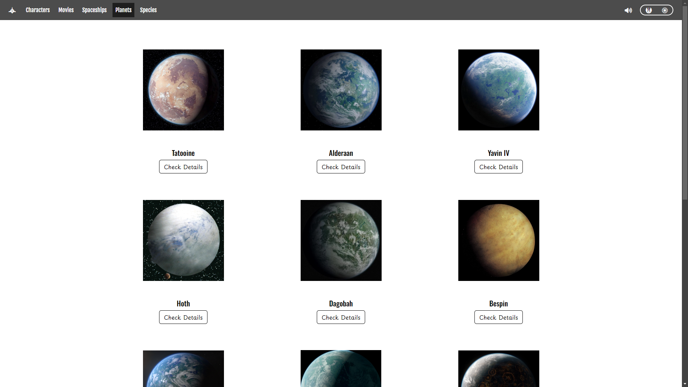
#### Space Ship List: 
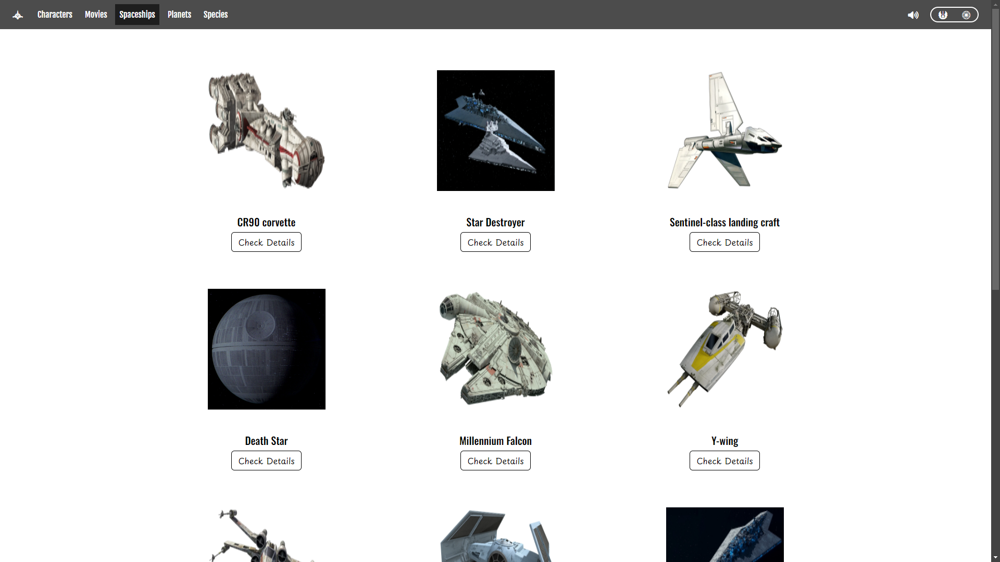
#### Species List: 
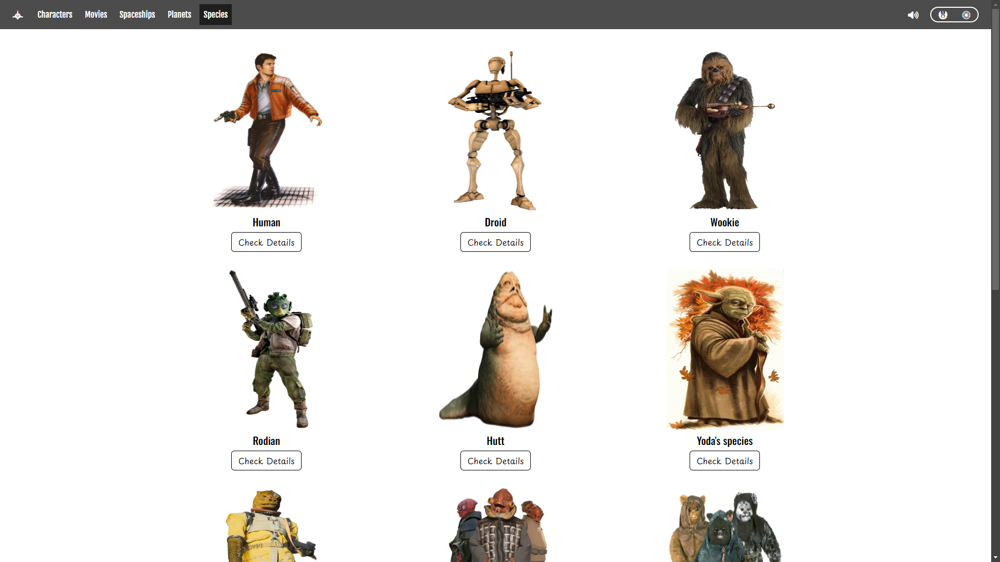
#### Details-Container: 
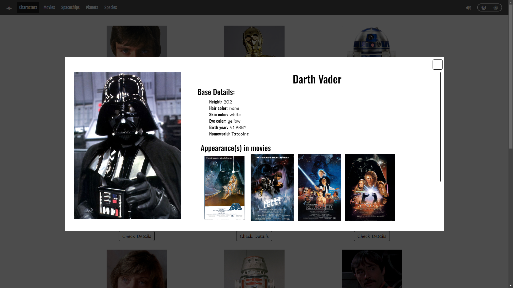
#### Movie-Details:
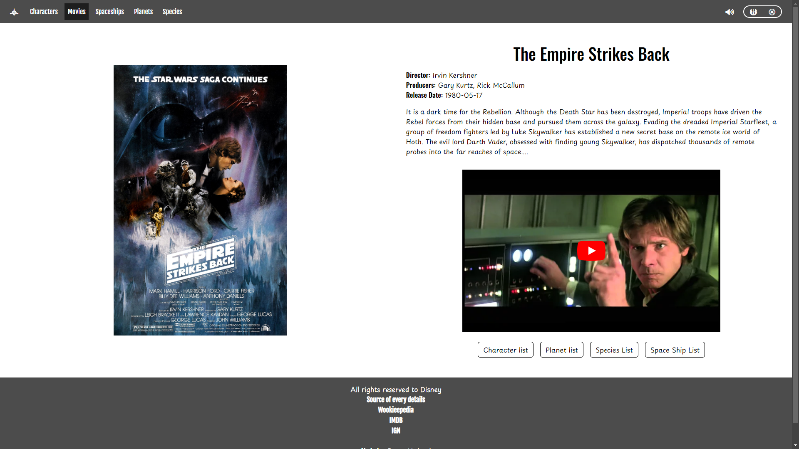

## Dark Theme:
#### Home Page:
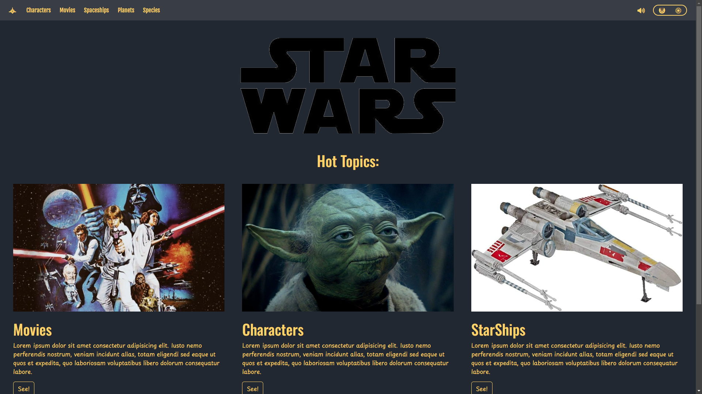
#### Character List:
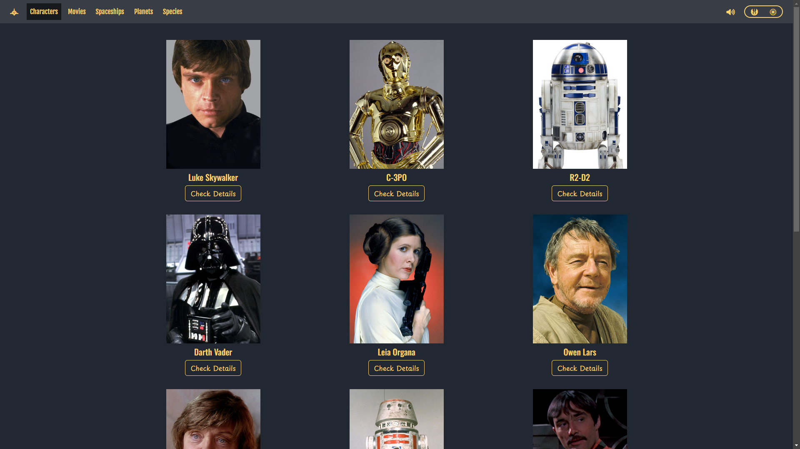
#### Planet List: 
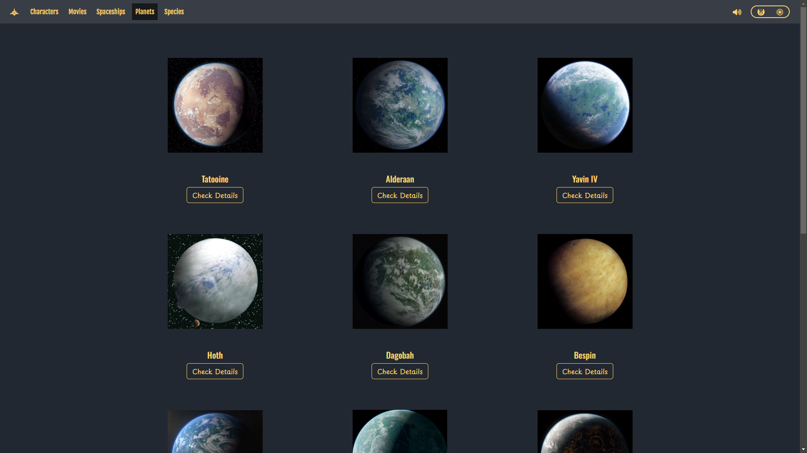
#### Space Ship List: 
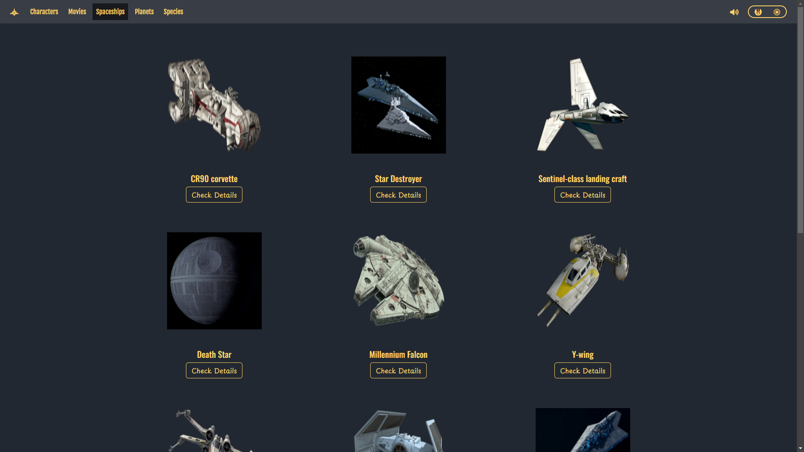
#### Species List: 
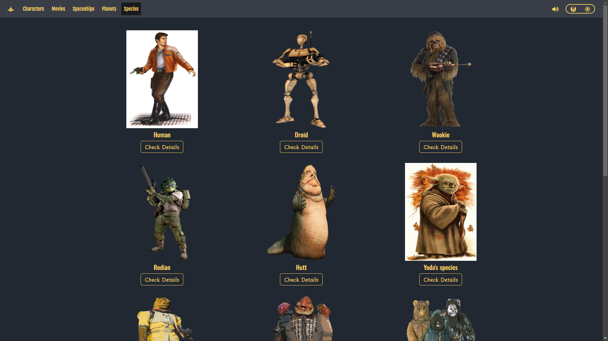
#### Details-Container: 
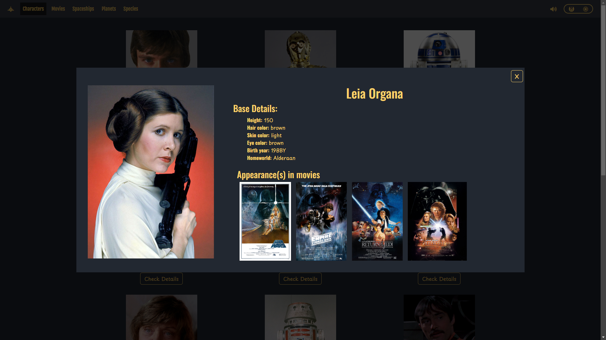
#### Movie-Details:
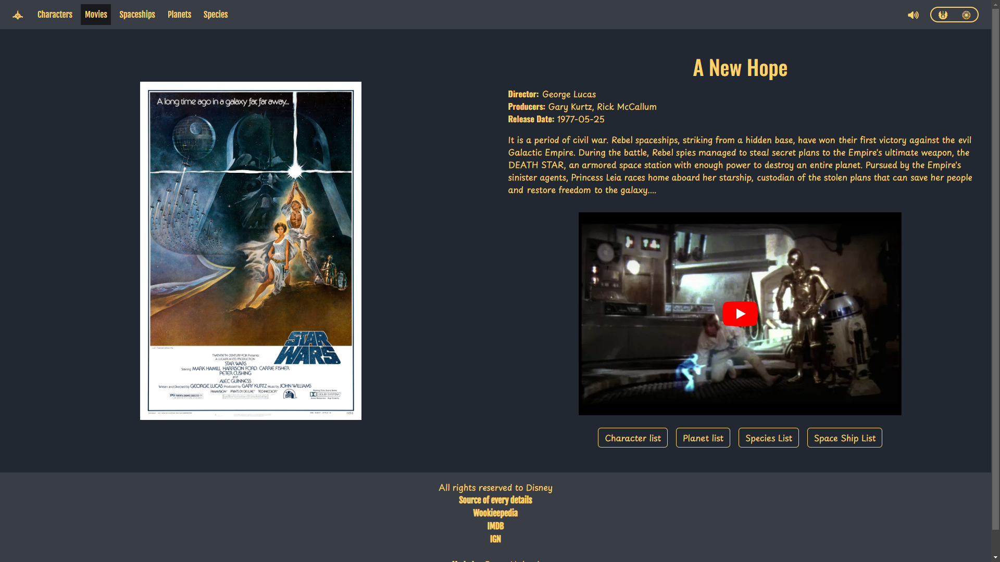

# Helpfull Websites:
- [Angular Docs]("https://angular.dev/overview")
- [Bootstrap Docs]("https://getbootstrap.com/docs/5.3/getting-started/introduction")
- [SWAPI]("https://swapi.dev/")
- [WOOKIEPEDIA]("https://starwars.fandom.com/wiki/Wookiee")
- [Stackoverflow]("https://stackoverflow.com/")
- [W3 schools]("https://www.w3schools.com/")
- [GeeksForGeeks]("https://www.geeksforgeeks.org/")
- [Font Awsome]("https://fontawesome.com/icons")

# Contact:
- [Facebook]("https://www.facebook.com/halmai.bence.5?locale=hu_HU")
- [Linked in]("https://www.linkedin.com/in/halmai-bence-5264062a4/")
- Email: sulisdolgok8@gmail.com
